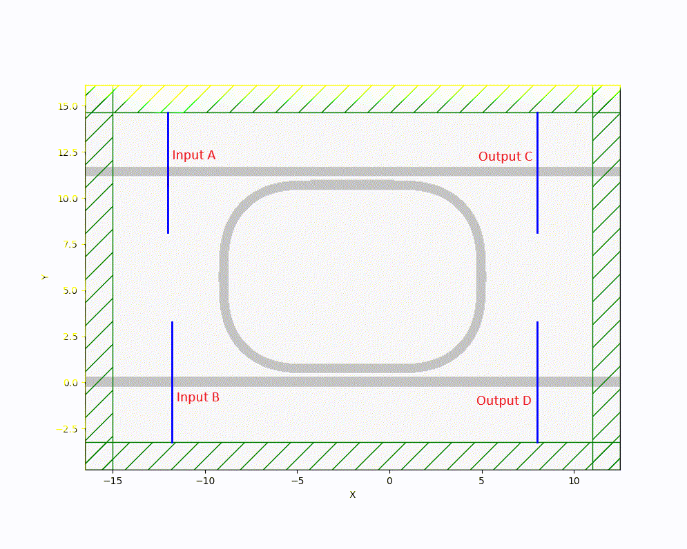
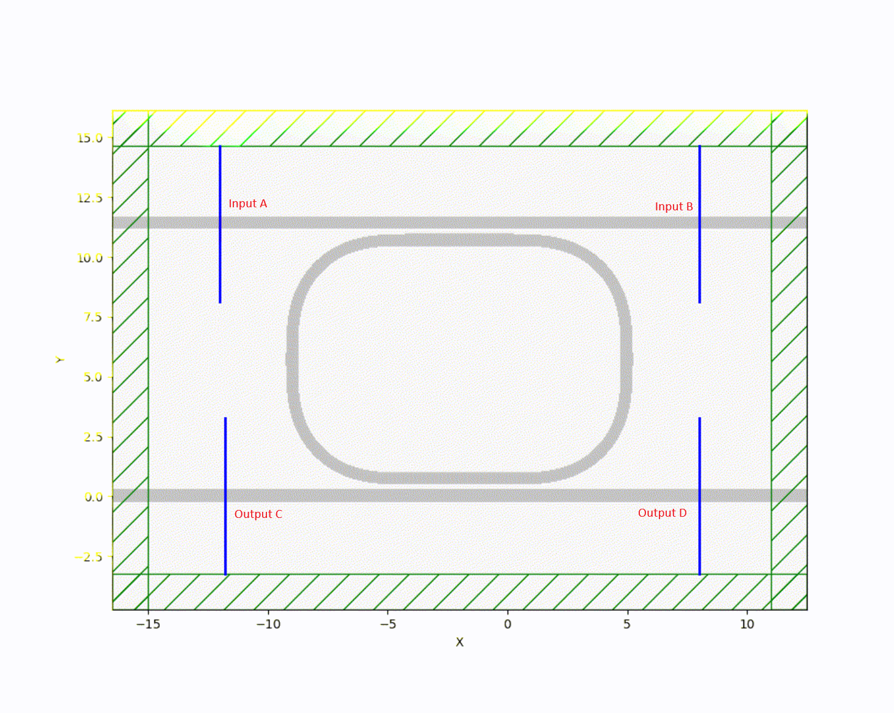
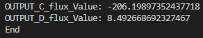
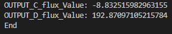
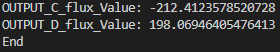
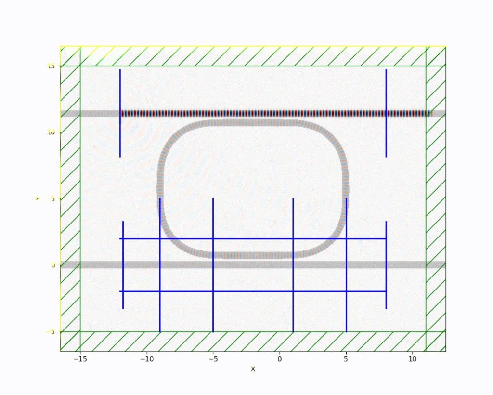
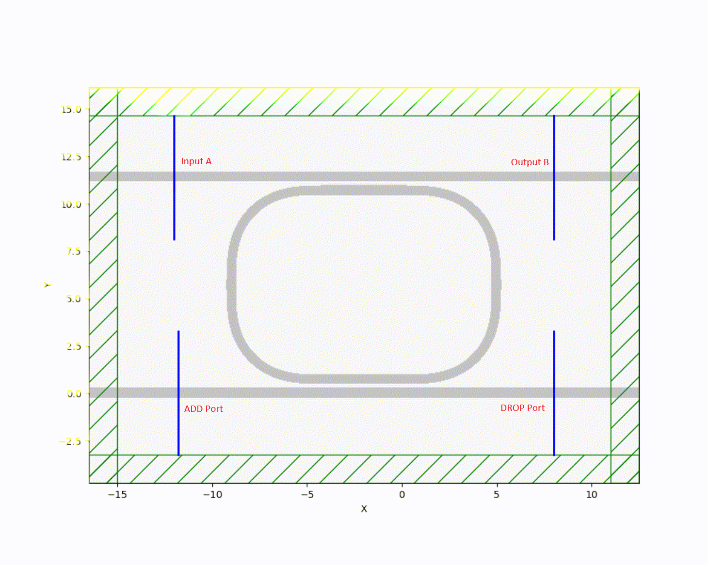
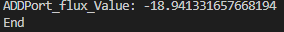
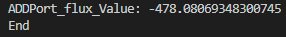

# Design-and-Simulation-of-Optical-Logic-Gates-using-Ring-Resonators
링 공진기를 이용한 기본적인 게이트 구현 및 시뮬레이션

# **Key Features**
**Detailed Physical Analysis of Ring Resonator**  
**Introduction of a New component Heater**

# **Introduction**
이번 프로젝트는 링 공진기를 이용한 기본적인 게이트 (AND,OR,NOT)를 구현하고 FDTD 시뮬레이션으로 검증하는 프로젝트 입니다.  
(추후 다른 게이트도 업데이트 할 예정입니다.)  
이번 프로젝트에 채용한 소자는 상단과 하단에 버스 도파로가 배치된 Dual-port Ring Resonator 입니다.  
처음에는 트랜지스터처럼 Resonator를 스위칭 소자로 단순하게 구현을 하려고 하였으나, 실제 PIC 기반의 설계는 기존 회로 설계와는 다르게  
접근해야함을 이번 프로젝트를 진행하면서 알게 되었습니다 그리고 분석함을 해보면서 흥미로운 현상을 볼 수 있었습니다.  
(사실 전 프로젝트의 연장선 같이 되어버렸지만..)  

# **Optical AND-Gate and Analysis**
먼저 시도를 해본것은 Optical AND Gate 입니다.  
Dual-port Ring Resonator의 특성을 분석하는 과정에서 AND Gate에 대한 해답을 빠르게 발견하였습니다.  
설계자가 포트에 대한 정의에 따라 해석에 이견이 있을 수 있으나 해당 시뮬레이션의 결과를 토대로 분석을 하였을때  
Dual-port Ring Resonator의 구조는 AND Gate의 조건을 만족함을 확인이 가능합니다.  

**1.Port의 정의 및 입력 테스트**

저는 왼쪽 상단을 Input A, 왼쪽 하단을 Input B로 지정하고, 우측상단 그리고 하단을 Output C, D로 지정 하였습니다.  
먼저 상단의 도파로 A에 Pulse input을 가해보도록 하겠습니다.  

사진에 나오는 것 처럼 A에서의 빛이 커플링으로 인해 링으로 에너지가 빠져나갑니다. 이때 빛의 방향은 그대로 왼쪽에서 오른쪽이며  
최종적으로 하단의 도파로 B로 에너지가 빠지게 되는데 이때 저희는 출력단의 정의를 C와 D로 하였기에 해당 입력의 출력은 0 입니다.  
이번엔 하단의 도파로 B에 Pulse input을 가해보도록 하겠습니다.

첫번째 사진을 상하 반전한것과 같은 결과를 볼 수 있었습니다.  
B에서 커플링으로 옮겨진 빛이 링을 돌면서 상단의 도파로 A에 옮겨지는것을 볼 수 있었고  
A는 입력단 이기 때문에 출력은 0 이라는것을 알 수 있었습니다.  
자 그럼 이제 A와 B에 둘다 Pulse input을 가해보도록 하겠습니다.

예상을 한것과 같이 출력이 1이 되는것을 볼 수 있었습니다.
하지만 이때 두가지 관찰점이 있습니다.    

**1.링 내부 빛의 충돌**  
각각 입력 A와 B에서 커플링이 일어난 빛의 이동 경로는 A는 시계 방향 B는 반시계 방향 입니다.  
이 두 빛은 링 내부에서 3시 방향에 충돌이 일어나는데 이는 보강, 상쇄, 보강, 상쇄간섭이 연속적으로 이루어 지는 것 입니다.  
이는 마치 맥놀이 현상처럼 보일 수 있으나 이는 완전히 고정된 정상적인 파형입니다.  
왜냐하면 두 빛의 주파수는 완전 동일하게 주었기 때문입니다.  
또한 두 빛이 충돌을 하고 보강, 상쇄간섭이 연속적으로 이루어질때 빛은 제자리에 고정이 되어 있는것을 볼 수 있습니다.  
그리고 이 정상파가 에너지를 역방향으로 전파를 하는것을 볼 수 있었고 이때 두 빛의 충돌 지점은 9시 방향 입니다.  
이때도 마찬가지로 빛이 보강, 상쇄 간섭이 연속적으로 이루어지지만 빛은 일정시간동안 움직이지를 않습니다.  

**2.진정한 맥박 현상?**  
진정한 맥박 현상을 관찰하기 위해 입력 B에 다른 주파수를 주고 관찰을 해보도록 하겠습니다.  

  

사실 크게 다른게 안보입니다. 이는 입력이 Pulse 이기 때문입니다.  
Pulse의 경우는 충돌과 탈출의 시간이 매우매우 짧기 때문에 별 차이를 볼 수 없었습니다.  
그러면 지속광(Continuous Wave, CW)의 경우는 잘 나오지 않을까? 라는 생각이 들었으므로 지속광으로도 해보았습니다.  
결과는 다음과 같습니다.  

  

**1단계: 3시 방향에서의 충돌**    
주파수가 다른 두 빛이 3시에서 처음 충돌을 하였을때는 제자리에서 보강, 상쇄를 일으킵니다  

**2단계: 9시 방향에서의 충돌**  
두 빛이 링을 반바퀴를 돌아 9시방향에서 충돌이 이루어 졌을때 이때 링 내부의 모든 빛이 위상이 실시간으로 계속 뒤틀립니다.  

**3단계: 3시 방향에서부터 일어나는 상쇄 소멸**  
결국 자연 현상이기 때문에 시간이 지나면 지날수록 exponential decay에 도달을 하게 됩니다.
이 말은 즉 두 빛의 위상이 180도의 차이에 도달하여 완벽한 상쇄간섭 및 방사손실이 일어나 안정 상태에서 출력이 최저점으로 수렴함을 확인 했습니다.

이렇게 AND Gate를 설계 구현 및 시뮬레이션을 통한 검증을 완료 하였습니다.  
생각지도 못한 현상이 일어나서 공부를 해야하는게 많아 AND Gate 부분이 조금 길어졌습니다.  

# **Optical OR-Gate**
Logic Gate중 OR-Gate를 구현 및 시뮬레이션을 해보겠습니다.
사용된 소자는 AND-Gate와 마찬가지로 Dual-port Ring Resonator 입니다.

**1.Port의 정의 및 입력 테스트**
  

이번에는 상단 버스 도파로의 좌측과 우측을 Input A, B로 정의를 하고 하단 버스 도파로 좌측과 우측을 Output C, D로 정의를 하였습니다.  
OR-Gate의 진리표를 입증하기위해 이제 입력을 가해보겠습니다.  

  

먼저 A에 입력을 가했을때의 사진입니다.  
커플링이 이루어져 링 도파로로 들어간 빛이 회전을 하면서 사진상으로 보았을때  
Output D로는 빛이 흘러가지 않고 C로만 흘러가는 모습을 볼 수 있습니다.  
다음은 B에 입력을 가해보겠습니다.  

  

B에 입력을 가했을때 마찬가지로 링 도파로로 흘러간 빛이 회전을 하면서 Output C에 출력이 가지 않고 D로 가는것을 볼 수 있습니다.  
마지막으로 A와 B 둘다 입력을 가해보겠습니다.  

    

상단에 입력된 두 빛이 충돌을 하며 링 도파로과 커플링이 이루어 지며 링 내부의 빛이 하단 버스 도파로에서 충돌을 하며 커플링이 이루어집니다.
이때 사진으로 보이는것 처럼 Output C, D에 빛이 나아가는것을 볼 수 있으며 완벽하게 OR-Gate의 진리표와 동일함을 입증하였습니다.

**2.의문점**
OR-Gate에서 Input A, B에 동시에 입력을 가했을때 서로의 빛이 충돌을 할때 문제가 되지 않을까? 라는 의문이 있을 수 있습니다.  
이에 대한 해답은 다음과 같습니다  
**"Linearity(선형성)과 SuperPosition(중첩의 원리)"**  
현재 이 세계는 선형세계 이므로 SuperPosition(중첩의 원리)를 따라야합니다.  
선형 세계에서의 빛이 서로 충돌을 하였으므로 사진과 같이 빛이 보강, 상쇄 현상이 연속적으로 이루어짐을 볼 수 있으나  
여기서 위상이 반전되지는 않습니다.  
이 논리를 입증하기 위해 제대로 값이 나오는게 맞는가를 확인하기 위해 저는 flux를 측정을 해보는걸 선택을 하였습니다.  
AND Gate때와 달리 파란색 선이 하나 있는 이유가 바로 Flux를 측정하기 위해 탄생한 object입니다.  
결과를 한번 보겠습니다.  

    

Input A일 경우 Output C의 flux value 가 -206 Output D의 flux value가 약 8.5입니다.

 

Input B일 경우 Output C의 flux value가 -8.8 Output D의 flux vaule가 192.8로 측정이 되었습니다

 

Input A, B일 경우  OUTPUT C, D의 flux value가 각각 -212.4, 198이 측정이 되었습니다.  

이 수치를 해석하자면 A에 입력을 가했을때 D에서 측정되는 flux가 0에 가까운 수치가 나오므로 D의 출력은 0이다 라고 볼 수 있고  
B에 입력을 가하면 반대로 C가 0에 가까운 수치이기 때문에 C의 출력은 0이고 D의 출력은 1이다.  
마지막으로 A, B동시에 입력을 가하면 두 수치가 각 입력마다 측정 하였을때 나온 값과 근사한 값이고 0과 멀기 때문에 C, D의 출력이 1 이라는걸 증명하는 수치입니다.  

해당 사진들은 VS Code에서 시뮬레이션 작동을 시키고 마쳤을때 Terminal에 출력되는 값입니다.  
첨부한 코드에 나와있듯이 임의로 정하여 출력한 값이 아닙니다.  
모두 단위시간 500으로 측정을 하였습니다.
다음은 NOT-Gate 입니다.

# **Optical NOT-Gate**
이번에는 AND, OR와 달리 phase shift 역할을 해주는 heater를 사용을 할려고 하였습니다.  
gdsfactory module에서 ring_double_heater 또는 ring_single_heater로 parameter가 있으나 
Meep FDTD simulation 에서는 이 heater에 포함되어있는 material를 지원을 안하는걸 확인하였습니다.  
TIN(티타늄 질화물), aluminum에 대한 정보가 없다는 이야기입니다.  
어차피 원하는 것은 실리콘에 열을 가하여 위상을 늦추는게 목표이니 다른 애들은 무시해도 괜찮겠다 라고 판단 하였습니다.  

*실리콘은 열을 가하면 굴절률이 올라갑니다. 왜냐하면 실리콘의 열 광학 계수의 값은 양수이기 때문입니다.  
*이로인해 band gap shift effect가 일어나며 이는 실리콘의 온도가 올라가면 enegy band gap이 좁아지면서 분극이 더 쉽게 이루어진다 입니다.  

그래서 이를 무시하고 측정 시도를 해볼려고 다음과 같이 매핑을 해보았습니다.  

material_mapping = {
    "tin": mp.vacuum,         
    "aluminum": mp.vacuum,    
    "si": mp.Medium(index=3.47),
    "sio2": mp.Medium(index=1.45)
}

sim_results = gm.get_simulation(
    component=c,
    resolution=20,
    is_3d=False,
    material_name_to_meep=material_mapping 
)

sim = sim_results['sim']

코드를 수정하여 진행을 해보았지만 더욱 곤란한 상황이 연출이 되었습니다.  

  

이걸보고 heater 도입을 하지 말아야하나.. 라고 생각을 하였지만 방법은 있었습니다.  
바로 직접 도파로의 굴절률을 조정을 하는 것 입니다.  
코드를 보았을때 PDK 활성화 이후 바로 보이는 코드는 다음과 같습니다.  

heater_ON = True

silicon_value = 4.5 if heater_ON else 3.47  

물론 기계적으로 heater를 ON, OFF를 할 수는 없지만 True 상태에서 시뮬레이션 결과를 보고 False 상태에서 시뮬레이션 결과를 보는게  
기계적으로 ON OFF할때와 다를게 없다고 판단이 됩니다.  
조금 아쉽긴 하지만 이건 Meep FDTD의 한계이므로 수긍을 해야합니다.  
추후에 Ansys Lumerical FDTD같은 시뮬레이터로 한번 구현을 해보겠습니다.

**1.Port정의**

  

이번에 정의한 Port는 사진과 같이 되어있습니다.
왼쪽 상단은 Input A이며 오른쪽 상단은 Output B입니다. 이때 상단의 도파로에는 항상 Continuous Wave가 있습니다.  
ADD Port는 최종 출력단 이고 Drop Port는 쓰지않는 port입니다.

**2.다른 게이트와의 차이점?**
이번 NOT-Gate는 AND, OR와는 명백히 다른점이 있습니다.  
바로 NOT-Gate의 출력을 바꾸는건 heater를 작동시키는 **"전기신호"** 입니다.
그렇기에 NOT-Gate의 입력은 heater를 작동시키는 전기신호가 입력이며 출력은 빛으로 정의 할 수 있습니다.

**3.입력 테스트**  
먼저 Heater가 True 일때를 보겠습니다.(입력이 1)  

Heater가 True면 굴절률이 증가하므로 링 내부로 들어가는 빛이 거의 0에 수렴합니다.  
그렇기에 사진과 같이 커플링이 거의 이루어지지 않는것을 볼 수 있으며  
이를 뒷받침할 지표는 flux를 측정하면 됩니다. 다음 사진은 이 flux를 측정하여 Terminal에 나온 값을 찍은 것 입니다.  

사진과 같이 최종 출력단 ADDPort에 flux가 -18.9입니다. 즉 0에 수렴하는 과정이라고 볼 수 있겠습니다.  
이로인해 입력이 1이면 출력이 0이 나온다는 것을 잘 따라주는 모습입니다.  

다음은 Heater가 False일때는 보겠습니다.(입력이 0)  

  

사진과 같이 입력이 0이니 Heater가 작동하지 않아 위상이 뒤쳐지지않아 커플링이 잘 이루어 졌습니다.  
또한 최종 출력단 ADDPort의 flux를 측정하여 잘 작동한다는것을 수치적으로 관찰하겠습니다.  

  

사진에도 나오는것 처럼 최종출력단 ADDPort의 flux가 -478로 출력이 아주 잘 나오는것을 볼 수 있었습니다.

## 🏁 Conclusion & Future Work (마무리를 하며)
본 프로젝트를 통해 **Silicon Photonics 기반 마이크로 링 공진기**를 활용하여 광 논리 게이트(AND, OR, NOT)의 거동을 FDTD 수치해석으로 완벽히 증명해 냈습니다. 
특히, 수동형(Passive) 교차 도파로의 선형적 중첩 한계를 극복하기 위해 **열광학 효과(Thermo-optic effect) 기반의 능동형(Active) 구조로 발전**시키는 과정에서 유의미한 물리적 통찰을 얻었습니다.
다음 프로젝트로는 Adder와 ALU가 예정 되어있습니다.

# **Requirements**
- `Meep`
- `gdsfactory`
- `gplugins`
- `Python 3.12.3`

해당 코드는 WSL을 설치하여 Ubuntu Terminal로 모듈을 설치를 하여 VSCode로 작성

